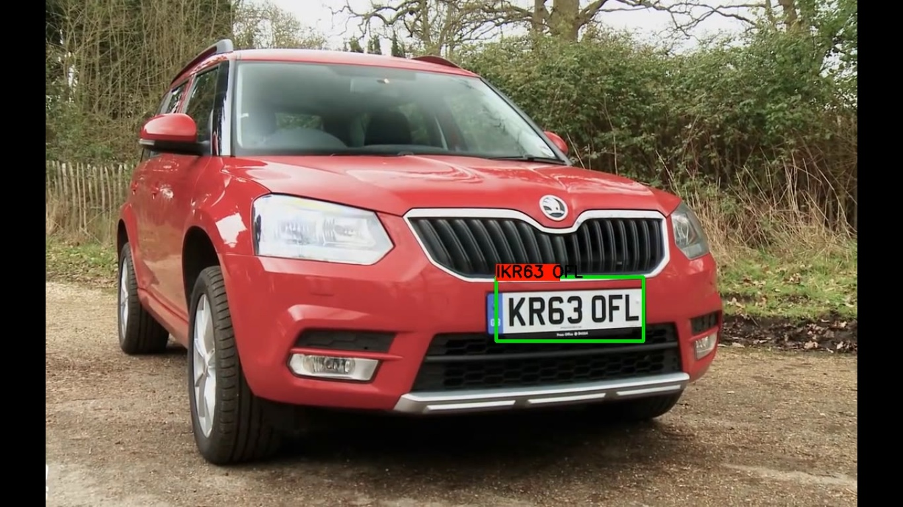

# Vehicle-Number-Plate-Recognition-Using-Deep-Learning-Algo

"License plate recognition".
It can work for high quality video with vehicle clearly visible.I used "pytesseract" free library. 
I didn't tried other but Microsoft OCR api was in my mind to use further. 
I enclosed running result file for execution step.
As it was run on windows, it requires "tesseract" windows application to install first and include  its path as done in python code file.
It requires a trained model to detect number plates which i will upload soon.!

